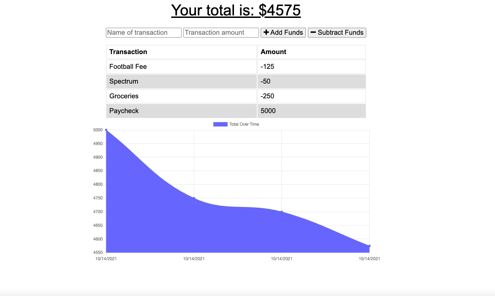
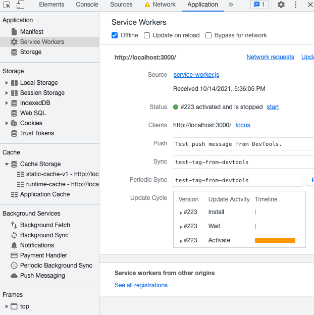

# Online Offline Budget Tracker

[Link to Deployed Site](https://evening-cove-59358.herokuapp.com/)

## Table of Contents
- [Description](#Description)
- [Usage](#Usage)
- [Screenshots](#Screenshots)
- [License](#License)
- [Languages](#Languages)
- [Questions](#Questions)

## Description
This application is a budget tracker where the user will be able to add expenses and deposits to their budget with or without a connection. When entering transactions offline, they should populate the total when brought back online.

## Usage
To allow the user to use their budget application even when offline. It will store data so it can still be accessed when brought back online. This is helpful for people who often travel.

## Screenshot

-------

## License
MIT 

## Languages
JavaScript, HTML, CSS, MongoDB

## Questions
Please contact me at lauraRweiner@gmail.com if you have any questions or suggestions.